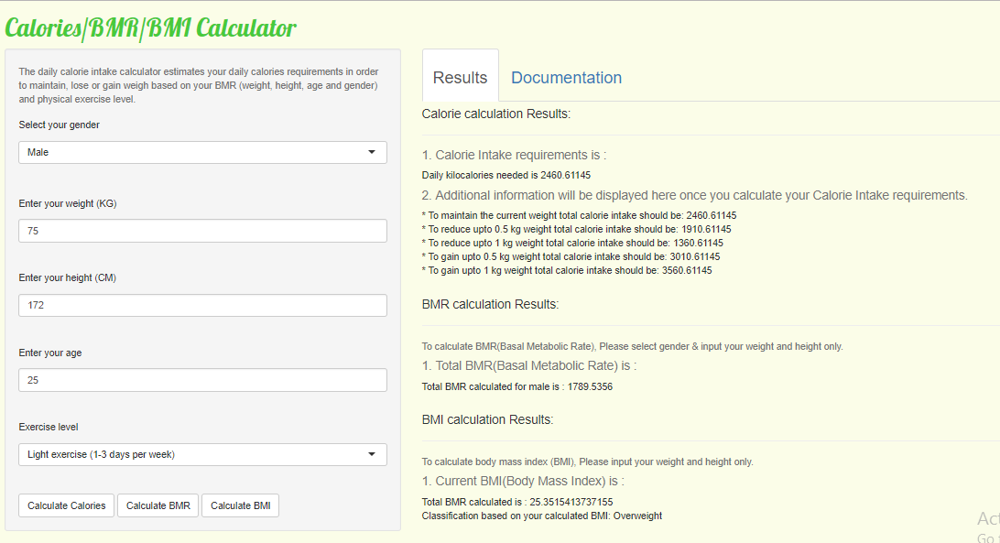

## Overview
This presentation related to final project of **Developing Data Product** which is a part of the Coursera Data Science Specialization. It contain documentation for the application **Health Check Calculator** created using shiny.

This application is useful to calculate daily calories intake along with current basal metabolic rate (BMR) and Body Mass Index (BMI).

- Calories require in order to maintain, lose or gain weight based on your BMR (weight, height, age and gender) and physical exercise level.
- BMR (Basal Metabolic Rate) represents an estimate of calories burned while resting.
- The BMI is an attempt to quantify the amount of tissue mass (muscle, fat, and bone) in an individual.

## Application & Source code

The application is build using Shiny package and the source code is in 2 files:

- `ui.R`
- `server.R`

Both files are placed in git hub location: <https://github.com/niprakas/Devloping-Data-Product>

The Application can be located in following link: <https://niprakas.shinyapps.io/HealthCheckCalculator/>

## Application functionality

Application can be used to perform regular health check by evaluating the amount of daily calorie intake. 
User need to enter their gender, weight in kg, height in cm, current age and their level of Activity in application. 

```{r, out.width='50%'}
weight <- 75
height <- 174
age <- 26
bmr <- 66.4730 + (13.7516 * weight) + (5.0033 * height) - (6.7550 * age)
calorie <- bmr * 1.2
calorie
bmr
```

## Application screenshot with example

```{r, echo=FALSE, out.width= '100%'}
   
```

